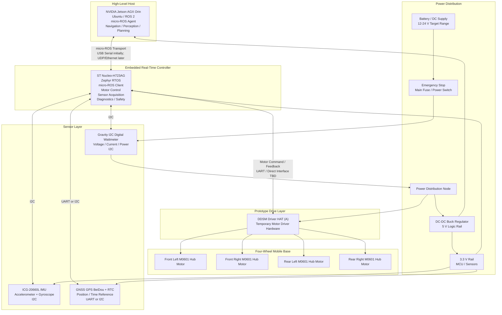

# Zephyr micro-ROS Robot Control Firmware

> **Status:** Work in progress / early hardware integration stage  
> **Current milestone:** ICG-20660L IMU driver integrated and validated with polling + trigger samples. Next focus: `/cmd_vel` subscriber, command timeout fail-safe, motor bring-up, wattmeter integration, and ROS 2 interface definition.

This repository contains embedded firmware for a Zephyr RTOS based robot control project. The firmware runs on an **ST Nucleo-H723AG** board and communicates with a high-level ROS 2 host through **micro-ROS**.

The target robot platform is a four-wheel mobile base using DDSM/M0601 hub motors, onboard IMU, GNSS, and battery power monitoring. The high-level host is planned to be an **NVIDIA Jetson AGX Orin**, which will run the ROS 2 stack, micro-ROS Agent, navigation, perception, planning, and high-level control.

---

## Current Progress

- [x] Zephyr RTOS environment bring-up
- [x] micro-ROS basic bring-up
- [x] Nucleo-H723AG selected as embedded real-time controller
- [x] Jetson AGX Orin selected as ROS 2 host
- [x] Initial hardware architecture drafted
- [ ] micro-ROS topic/service interface finalized
- [ ] `/cmd_vel` subscriber implemented
- [ ] command timeout fail-safe implemented
- [ ] DDSM motor communication verified from Nucleo
- [ ] single motor bring-up completed
- [ ] four-wheel velocity mapping completed
- [ ] wheel feedback publishing completed
- [ ] wattmeter driver integrated
- [x] IMU driver integrated
- [ ] GNSS driver integrated
- [ ] diagnostics and safety state machine completed

---

## Project Goals

The project aims to provide a reliable low-level control and telemetry layer for a mobile robot platform.

The embedded controller should handle:

- Real-time motor command handling
- Wheel motor communication and feedback acquisition
- Sensor data acquisition
- Battery voltage/current/power monitoring
- Safety and diagnostic logic
- micro-ROS communication with the ROS 2 host

The high-level host should handle:

- ROS 2 control stack
- Navigation
- Perception
- Localization
- Planning
- High-level decision making
- Data logging and visualization

---

## System Architecture

The system follows a distributed robot control architecture:

- The **Nucleo-H723AG** runs Zephyr RTOS and micro-ROS firmware.
- The **Jetson AGX Orin** runs Ubuntu, ROS 2, and the micro-ROS Agent.
- The **DDSM Driver HAT** is currently used as temporary motor driver hardware.
- The onboard ESP32 on the Driver HAT is not intended to be used in the final project architecture.
- Motor control logic is handled by the Nucleo firmware.
- A future hardware revision may replace the Driver HAT with a custom motor driver PCB.



---

## Hardware Components

### Embedded Controller

- **Board:** ST Nucleo-H723AG
- **RTOS:** Zephyr RTOS
- **Middleware:** micro-ROS
- **Responsibilities:** sensor acquisition, motor driver communication, low-level command handling, telemetry publishing, safety and diagnostics

### High-Level Host

- **Host:** NVIDIA Jetson AGX Orin
- **Expected stack:** Ubuntu, ROS 2, micro-ROS Agent, navigation, perception, robot control software

### Motor and Drive System

| Component | Quantity | Purpose | Status |
|---|---:|---|---|
| M0601 Direct-Drive Hub Motor, Right Orientation | 1 | Wheel actuation | Current inventory |
| M0601 Direct-Drive Hub Motor, Left Orientation | 2 | Wheel actuation | Current inventory |
| DDSM Driver HAT (A) | 1 | Temporary motor driver board | Prototype |
| All-metal Compact UGV Suspension (A) | 4 | Mechanical suspension | Current inventory |

> Note: The final four-wheel configuration and motor orientation layout are still under development. Current inventory appears to contain 3 motors, while the target platform is a 4-wheel mobile base. Add the missing motor orientation once the final chassis layout is fixed.

### Sensors

| Component | Quantity | Interface | Purpose | Integration Priority | Status |
|---|---:|---|---|---|---|
| Gravity I2C Digital Wattmeter | 1 | I2C | Voltage, current, power monitoring | High | Not started |
| Fermion ICG-20660L 6-Axis IMU | 1 | I2C | Inertial measurement | Medium | Driver + samples verified |
| Gravity GNSS GPS BeiDou Positioning Module with RTC | 1 | UART / I2C | Global positioning and time reference | Medium / Low | Not started |

---

## Current Integration Plan

During early bring-up, keep the system simple and deterministic.

- **micro-ROS transport:** UDP first (current `h723_rover_controller` default), USB Serial also supported
- **Future transport option:** UDP/Ethernet once the motor and sensor stack is stable
- **Motor interface:** UART or direct DDSM interface, to be confirmed during motor bring-up
- **IMU interface:** I2C (`i2c1`, address `0x69` with SA0 high); driver supports polled and data-ready trigger modes
- **GNSS interface:** UART first, I2C optional
- **Wattmeter interface:** I2C
- **Main development host:** Jetson AGX Orin or development PC running ROS 2 and micro-ROS Agent

---

## ICG-20660L IMU Integration Notes

The in-tree Zephyr driver is located at [`zephyr/drivers/sensor/tdk/icg20660l/`](zephyr/drivers/sensor/tdk/icg20660l/).

- **Part vs. module naming:** The datasheet part is **ICG-20660**; the "L" in `icg20660l` refers to the Fermion/DFRobot breakout module currently used on the robot.
- **Interface:** I2C (Fast Mode, up to 400 kHz). The module is wired to `i2c1` at address `0x69` (SA0 high) in the test overlays.
- **Supported channels:** `SENSOR_CHAN_ACCEL_*`, `SENSOR_CHAN_GYRO_*`, and `SENSOR_CHAN_DIE_TEMP`.
- **Full-scale ranges:**
  - Accelerometer: ±2/4/8/16 g via device-tree `accel-fs`.
  - Gyroscope: ±125/250/500 dps via device-tree `gyro-fs`.
- **Output data rate:** Configured through the `odr` device-tree property or `SENSOR_ATTR_SAMPLING_FREQUENCY`. The driver uses `SMPLRT_DIV` with a 1 kHz internal rate (DLPF_CFG = 1), giving 1000/n Hz where n = 1..256.
- **Trigger support:** `SENSOR_TRIG_DATA_READY` using a dedicated GPIO interrupt (`int-gpios`). The `accel_trig` sample demonstrates this.
- **Sample applications:**
  - [`apps/accel_polling/`](apps/accel_polling/) — polled read loop.
  - [`apps/accel_trig/`](apps/accel_trig/) — data-ready interrupt handler with per-second interrupt statistics.

### Known Limitations

- The driver is **I2C-only**. The Fermion module also exposes SPI pins, but SPI mode is not implemented.
- FIFO, wake-on-motion, and accelerometer offset registers are not supported.
- The driver reads `WHO_AM_I` **before** issuing the required soft reset. The datasheet states the correct `WHO_AM_I` value (`0x91`) is guaranteed only after the soft reset, so the identity check should be moved after `PWR_MGMT_1.DEVICE_RESET`.

---

## Tentative ROS 2 Interface

### Subscribed Topics

#### `/cmd_vel`

- **Type:** `geometry_msgs/msg/Twist`
- **Direction:** Jetson -> Nucleo
- **Purpose:** high-level velocity command for the mobile base
- **Expected behavior:** if no command is received within the timeout window, the MCU must command zero velocity

### Published Topics

#### `/mcu/heartbeat`

- **Type:** `std_msgs/msg/UInt32` or custom status message
- **Rate:** 1 Hz
- **Purpose:** confirms that the MCU firmware is alive

#### `/imu/data_raw`

- **Type:** `sensor_msgs/msg/Imu`
- **Rate:** 100 Hz target (configurable via device-tree `odr` or `SENSOR_ATTR_SAMPLING_FREQUENCY`)
- **Purpose:** raw accelerometer and gyroscope data from ICG-20660L
- **Status:** driver + polled/trigger samples verified; ROS 2 publisher not yet implemented

#### `/fix`

- **Type:** `sensor_msgs/msg/NavSatFix`
- **Rate:** 1-10 Hz depending on GNSS module output
- **Purpose:** GNSS position data

#### `/battery_state`

- **Type:** `sensor_msgs/msg/BatteryState`
- **Rate:** 1-5 Hz
- **Purpose:** voltage, current, power, and battery health telemetry

#### `/wheel_states`

- **Type:** `sensor_msgs/msg/JointState`
- **Rate:** 50-100 Hz target
- **Purpose:** wheel velocity, position, and feedback state

#### `/diagnostics`

- **Type:** `diagnostic_msgs/msg/DiagnosticArray`
- **Rate:** 1 Hz
- **Purpose:** firmware state, motor state, communication status, battery warnings, and safety faults

---

## Firmware Architecture Proposal

Recommended source tree:

```text
src/
  main.c
  app/
    app_state.c
    safety_manager.c
    diagnostics.c
  ros/
    microros_node.c
    ros_publishers.c
    ros_subscribers.c
  drivers/
    ddsm_driver.c
    icg20660l.c
    gnss.c
    wattmeter.c
  control/
    kinematics.c
    motor_controller.c
  board/
    board_config.c
include/
  app/
  ros/
  drivers/
  control/
```

Recommended layering:

```text
Hardware driver layer
        ↓
Control / kinematics layer
        ↓
Safety / state machine layer
        ↓
micro-ROS interface layer
```

Important rule:

> ROS callbacks should not directly drive motors. ROS callbacks should update command targets only. A periodic control thread should validate safety conditions and send motor commands.

---

## Suggested Zephyr Threads

| Thread | Suggested Rate | Responsibility |
|---|---:|---|
| `microros_thread` | executor driven | micro-ROS node, publishers, subscribers |
| `motor_control_thread` | 50-100 Hz | velocity command processing and motor output |
| `sensor_thread` | 100 Hz target | IMU acquisition and timestamping |
| `power_monitor_thread` | 1-5 Hz | wattmeter acquisition and battery checks |
| `diagnostic_thread` | 1 Hz | health status and diagnostic publishing |

The motor control thread should keep running even if ROS communication becomes unstable. If the ROS command stream times out, the control thread should command zero velocity.

---

## Control Model

For the first mobile base bring-up, use a simple differential/skid-steer velocity model.

```text
v_left  = v - omega * track_width / 2
v_right = v + omega * track_width / 2

wheel_angular_velocity = wheel_linear_velocity / wheel_radius
```

Initial wheel assignment:

```text
Front Left  = left side
Rear Left   = left side
Front Right = right side
Rear Right  = right side
```

Because motor orientation and wiring may change, keep motor direction configurable:

```text
motor_sign[FL] = +1 or -1
motor_sign[FR] = +1 or -1
motor_sign[RL] = +1 or -1
motor_sign[RR] = +1 or -1
```

Do not hard-code final motor direction until the physical chassis layout is confirmed.

---

## Safety Requirements

Safety logic should be implemented early, before high-speed testing.

Minimum firmware-level safety mechanisms:

- **Command timeout:** stop motors if `/cmd_vel` is not received within 200-500 ms.
- **micro-ROS disconnect fail-safe:** stop motors when the micro-ROS Agent is unavailable.
- **Battery undervoltage protection:** reduce speed or stop the robot below a configured voltage threshold.
- **Overcurrent warning:** publish diagnostics if current exceeds configured limits.
- **Emergency stop input:** reserve and monitor a GPIO input if hardware E-stop feedback is available.
- **Motor feedback watchdog:** stop or fault if motor feedback is missing.
- **Startup safe state:** robot must boot into an idle state with zero motor command.
- **Fault latch:** serious faults should require explicit reset or power cycle.

Recommended firmware state machine:

```text
BOOT
  ↓
WAIT_AGENT
  ↓
IDLE
  ↓
ACTIVE
  ↓
FAULT

ESTOP can override any state.
```

State descriptions:

- **BOOT:** initialize board, drivers, memory, and communication primitives
- **WAIT_AGENT:** wait for micro-ROS Agent connection
- **IDLE:** connected but motors disabled or commanded zero
- **ACTIVE:** valid command stream and safety conditions satisfied
- **FAULT:** safety violation, communication failure, or motor/sensor fault
- **ESTOP:** emergency stop active, motor commands forced to zero

---

## Bring-Up Roadmap

### Phase 1: micro-ROS Communication Validation

Goal: prove reliable communication between Nucleo and ROS 2 host.

- [ ] Start micro-ROS Agent on host
- [ ] Nucleo connects to Agent
- [ ] Publish `/mcu/heartbeat`
- [ ] Subscribe to `/cmd_vel`
- [ ] Verify command reception on MCU
- [ ] Add command timeout stop behavior

### Phase 2: Single Motor Bring-Up

Goal: prove that Nucleo can command one motor safely.

- [ ] Confirm physical interface to DDSM Driver HAT
- [ ] Confirm motor protocol and motor ID configuration
- [ ] Implement low-level DDSM frame transmit/receive
- [ ] Add simple motor test commands
- [ ] Test low-speed forward/reverse
- [ ] Read motor feedback
- [ ] Validate stop command

Suggested local motor test interface:

```text
motor ping 1
motor speed 1 50
motor stop 1
motor read 1
motor all_stop
```

### Phase 3: Four-Wheel Base Bring-Up

Goal: command all wheels consistently.

- [ ] Assign motor IDs
- [ ] Confirm physical wheel positions
- [ ] Configure motor direction signs
- [ ] Implement `cmd_vel` to wheel velocity conversion
- [ ] Test forward, backward, rotate left, rotate right
- [ ] Publish `/wheel_states`
- [ ] Verify odometry-related feedback

### Phase 4: Power Monitoring Integration

Goal: integrate battery telemetry and basic safety.

- [ ] Implement wattmeter I2C driver
- [ ] Publish `/battery_state`
- [ ] Add undervoltage warning
- [ ] Add undervoltage stop/limit behavior
- [ ] Add overcurrent diagnostics

### Phase 5: IMU Integration

Goal: publish usable raw IMU data.

- [x] Implement I2C driver for ICG-20660L
- [x] Verify accelerometer and gyroscope readings
- [ ] Calibrate sensor bias
- [ ] Publish `/imu/data_raw`
- [ ] Confirm frame convention with ROS 2 stack

### Phase 6: GNSS Integration

Goal: publish GNSS position and time reference.

- [ ] Select UART or I2C mode
- [ ] Parse GNSS output
- [ ] Publish `/fix`
- [ ] Validate outdoor reception
- [ ] Prepare for localization fusion on the ROS 2 host

### Phase 7: Host-Side Integration

Goal: connect firmware into the ROS 2 robot stack.

- [ ] Launch micro-ROS Agent automatically
- [ ] Verify all topics with `ros2 topic list`
- [ ] Echo and record telemetry topics
- [ ] Integrate wheel state with odometry pipeline
- [ ] Integrate IMU and GNSS into localization
- [ ] Prepare for navigation stack testing

---

## Power Distribution Notes

The current intended power path is:

```text
Battery / DC Supply
  → Emergency Stop / Main Fuse / Power Switch
  → Gravity I2C Digital Wattmeter
  → Power Distribution Node
      → High-current motor power to DDSM Driver HAT
      → DC-DC converter for 5 V logic rail
      → 3.3 V rail for MCU and sensors
```

Ground reference should be shared between:

- Battery
- Wattmeter
- Nucleo-H723AG
- DDSM Driver HAT
- Sensors
- Jetson AGX Orin, if powered from the robot

---

## Development Notes

### micro-ROS Agent

During early development, use serial transport for simplicity.

Example host-side workflow:

```bash
ros2 run micro_ros_agent micro_ros_agent serial --dev /dev/ttyACM0
```

Adjust the serial device path according to the actual host configuration.

### ROS 2 Smoke Tests

List topics:

```bash
ros2 topic list
```

Echo heartbeat:

```bash
ros2 topic echo /mcu/heartbeat
```

Send a low-speed command:

```bash
ros2 topic pub /cmd_vel geometry_msgs/msg/Twist "{linear: {x: 0.05}, angular: {z: 0.0}}"
```

Stop command:

```bash
ros2 topic pub /cmd_vel geometry_msgs/msg/Twist "{linear: {x: 0.0}, angular: {z: 0.0}}"
```

> Do not test wheel motion with the robot on the ground until motor direction, stop behavior, and E-stop behavior are verified.

---

## Open Questions

- [ ] What is the final motor count and orientation layout?
- [ ] What is the exact Nucleo-to-DDSM Driver HAT electrical interface?
- [ ] What is the DDSM command and feedback protocol used in this setup?
- [ ] Should micro-ROS transport remain serial or move to Ethernet/UDP?
- [ ] What are the final wheel radius and track width values?
- [ ] What are the battery voltage thresholds for warning, limiting, and shutdown?
- [ ] Will E-stop provide a digital feedback signal to the MCU?
- [ ] Will the custom motor driver PCB use the same firmware interface as the prototype?

---

## Immediate TODO

Recommended next tasks:

1. Define and freeze the first version of the ROS 2 topic interface.
2. Implement `/mcu/heartbeat` publisher.
3. Implement `/cmd_vel` subscriber.
4. Add command timeout fail-safe.
5. Verify single motor communication from Nucleo.
6. Add four-wheel motor abstraction.
7. Add configurable motor direction signs.
8. Publish wheel feedback.
9. Publish `/imu/data_raw` from the ICG-20660L driver output.
10. Integrate wattmeter and `/battery_state`.
11. Add diagnostics and safety state machine.

---

## Project Status Summary

This project is currently in the transition from software environment bring-up to hardware integration. Zephyr, micro-ROS, and the ICG-20660L IMU driver are all running. The next critical path is:

```text
ROS 2 command
  → micro-ROS Agent
  → Nucleo-H723AG
  → motor driver interface
  → DDSM hub motors
  → wheel feedback and diagnostics
```

Once this chain is reliable, the robot can move from firmware bring-up to controlled mobile base testing. In parallel, the verified IMU data can be wired into a `/imu/data_raw` publisher for the ROS 2 localization pipeline.
