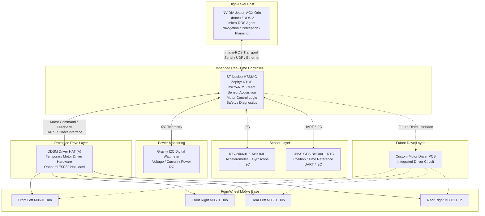
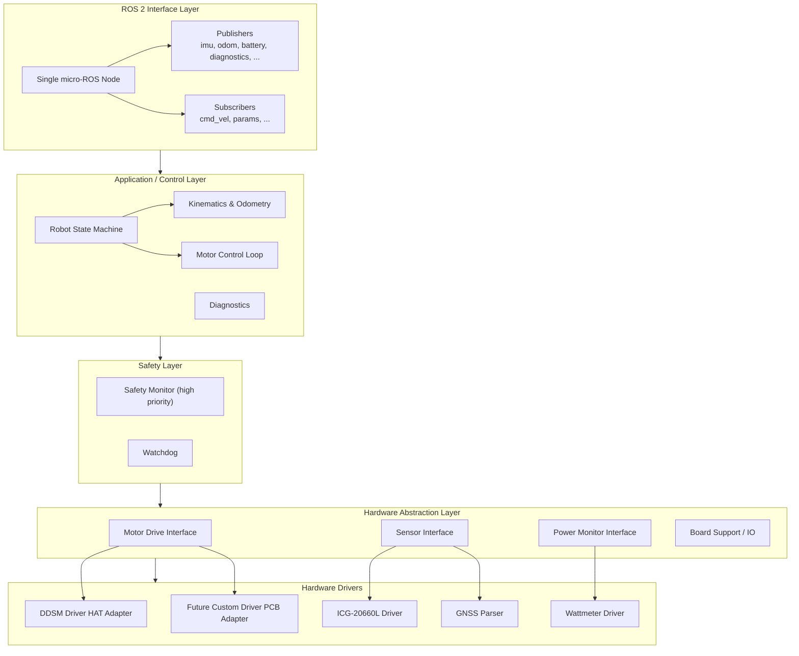
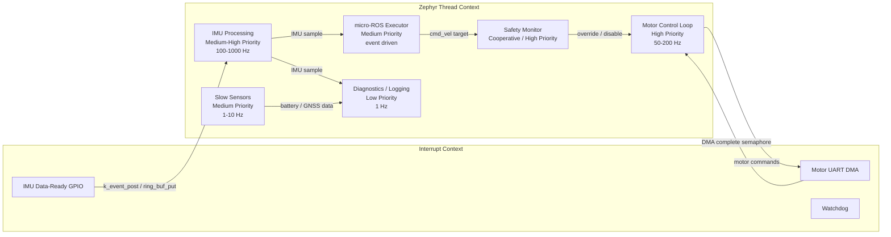
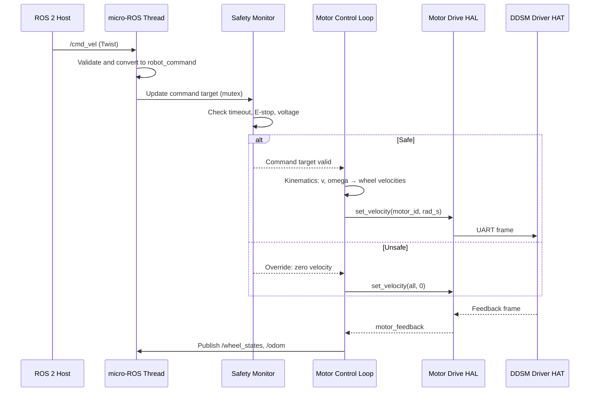

# Firmware System Architecture

This document defines the target software architecture for the Zephyr RTOS based robot control firmware. It is intended to guide the evolution of the current early-stage prototype — where the main app ([apps/h723_rover_controller/](apps/h723_rover_controller/)) is a basic micro-ROS publisher — toward a maintainable, portable, and real-time control system.

## Goals and Principles

The architecture is driven by three principles:

1. **Hardware-portable core.** Zephyr already abstracts the CPU and peripheral HAL. Our firmware builds an additional layer of abstraction around robot-specific hardware (motors, sensors, power monitors) so that the control core, safety logic, and ROS interface do not depend on a particular motor driver board, sensor breakout, or MCU board revision.

2. **RTOS-native design.** Real-time behavior is implemented with Zephyr kernel primitives — threads, work queues, timers, message queues, ring buffers, events, and semaphores — rather than polling loops or ad-hoc state machines. This gives deterministic latency, clear priority relationships, and efficient CPU usage.

3. **Safety-first command path.** Motor commands never originate directly from a ROS callback. A high-priority control thread owns the actuators, validates commands against safety constraints, and can override or zero them without relying on the ROS transport path.

## System Context



## Layered Firmware Architecture

The firmware is organized into layers. Each layer depends only on the layer below it, and hardware-specific code is confined to the bottom layers.



### Layer Responsibilities

| Layer | Responsibility | Examples |
| ----- | -------------- | -------- |
| **Hardware Drivers** | Vendor-specific peripheral drivers and protocol parsers. | ICG-20660L Zephyr driver, DDSM HAT UART protocol, GNSS NMEA parser, wattmeter I2C driver. |
| **Hardware Abstraction Layer (HAL)** | Stable interfaces used by the application. Hides whether a motor is driven by the DDSM HAT or a future custom PCB. | `motor_drive_set_velocity()`, `sensor_get_imu_sample()`, `power_get_battery_state()`. |
| **Safety Layer** | High-priority monitor that can override or disable actuators independent of ROS. | Command timeout, undervoltage, E-stop, watchdog, fault latching. |
| **Application / Control Layer** | Robot state machine, kinematics, control loops, diagnostics aggregation. | `/cmd_vel` to wheel velocities, odometry, fault classification. |
| **ROS 2 Interface Layer** | Single micro-ROS node with publishers and subscribers. | `/cmd_vel` subscriber, `/imu/data_raw`, `/battery_state`, `/odom`, `/diagnostics` publishers. |

## Hardware Decoupling Strategy

Zephyr decouples the firmware from the CPU through Devicetree and Kconfig. We extend that decoupling to robot hardware.

### Board Portability

- Devicetree overlays define pin mappings, buses, and sensor instances per board (e.g., [apps/h723_rover_controller/nucleo_h723zg.overlay](apps/h723_rover_controller/nucleo_h723zg.overlay)).
- Board-specific code lives in `board/` or is selected through Kconfig.
- The control core uses `DEVICE_DT_GET()` and stable symbolic names, not hard-coded peripheral addresses.

### Motor Drive Abstraction

The prototype uses the DDSM Driver HAT; a future revision will use a custom motor driver PCB. Both are hidden behind a common `motor_drive` interface.

```c
struct motor_drive_api {
    int (*init)(const struct device *dev);
    int (*set_velocity)(const struct device *dev, uint8_t motor_id, float rad_s);
    int (*get_feedback)(const struct device *dev, uint8_t motor_id, struct motor_feedback *fb);
    int (*emergency_stop)(const struct device *dev);
};
```

- `ddsm_hat.c` implements this API for the prototype.
- `custom_motor_pcb.c` implements it for the future board.
- Kconfig selects the active implementation; the control core is unchanged.

### Sensor Abstraction

Sensors are consumed through Zephyr's standard `sensor` subsystem where possible.

- **IMU:** `sensor_sample_fetch()` and `sensor_channel_get()` on the ICG-20660L device, supporting both polled and trigger modes ([apps/accel_polling/](apps/accel_polling/), [apps/accel_trig/](apps/accel_trig/)).
- **GNSS:** abstracted behind a `gnss` interface that returns parsed position/time structures, hiding UART vs. I2C transport details.
- **Wattmeter:** abstracted behind a `power_monitor` interface returning voltage, current, power, and status flags.

The application layer sees uniform data structures and sampling frequencies configured via Devicetree or runtime parameters, not driver-specific registers.

## RTOS Tasking Model

Real-time work is split into Zephyr threads with explicit priorities. The micro-ROS node is one thread; it does not perform real-time control.



### Recommended Threads

| Thread | Priority | Period / Trigger | Responsibility |
| ------ | -------- | ---------------- | -------------- |
| `safety_monitor` | High (cooperative) | 10-50 ms | Watch command timeout, E-stop, undervoltage, motor feedback loss. Can force zero velocity and latch faults. |
| `motor_control_loop` | High | 50-200 Hz | Read latest command target, compute wheel velocities from kinematics, send to motor drive interface, read feedback. |
| `imu_processing` | Medium-High | Data-ready interrupt or 100-1000 Hz timer | Fetch and timestamp IMU samples, publish to ROS or place in ring buffer. |
| `microros_executor` | Medium | Event driven / 1-10 ms spin | Handle ROS subscriptions (`/cmd_vel`), publish telemetry, manage node lifecycle. |
| `slow_sensor_loop` | Medium | 1-10 Hz | GNSS, wattmeter, and other low-rate sensors. |
| `diagnostics_loop` | Low | 1 Hz | Aggregate health flags and publish `/diagnostics`. |

### Inter-Thread Communication

- **Command target:** a `struct robot_command` protected by a mutex, written by the ROS subscriber and read by the safety monitor / control loop.
- **Sensor samples:** ring buffers or message queues from ISR/context to processing threads.
- **Safety events:** `k_event` flags posted by the safety monitor and consumed by the control loop and diagnostics thread.
- **Motor feedback:** shared state updated by the control loop and read by diagnostics.

## Control and Kinematics

The first mobile base uses a simple skid-steer model.

```text
v_left  = v - omega * track_width / 2
v_right = v + omega * track_width / 2
wheel_angular_velocity = wheel_linear_velocity / wheel_radius
```

- `v` and `omega` come from `/cmd_vel`.
- Wheel velocities are computed by the kinematics module.
- The motor control loop applies per-wheel direction signs to account for physical wiring and orientation.
- Odometry is computed from wheel feedback and published as `/odom` or `/wheel_states`.

Motor direction signs and wheel geometry are configurable (Kconfig or parameters) and must be verified against the final chassis layout.

## micro-ROS Interface Layer

### Single Node Design

The embedded controller exposes **one micro-ROS node**. This is the recommended topology because:

- **Lower resource usage:** one node, one executor, one agent handshake.
- **Simpler lifecycle:** initialize, connect, run, and tear down one entity.
- **Shared context:** publishers, subscribers, and parameters share the same node handle and allocator.
- **Concurrency is not limited by ROS nodes:** real-time parallelism comes from Zephyr threads, not from creating multiple ROS nodes.

Multiple nodes would only be justified if the ROS graph semantics require separate namespaces or lifecycle boundaries, and the MCU has sufficient RAM and initialization budget.

### Tentative Topic Interface

Based on [WIP.md](WIP.md), the first interface version is:

| Topic | Type | Direction | Rate | Purpose |
| ----- | ---- | --------- | ---- | ------- |
| `/cmd_vel` | `geometry_msgs/msg/Twist` | Subscribe | event driven | High-level velocity command. |
| `/mcu/heartbeat` | `std_msgs/msg/UInt32` | Publish | 1 Hz | MCU alive indicator. |
| `/imu/data_raw` | `sensor_msgs/msg/Imu` | Publish | 100 Hz | Raw accelerometer and gyroscope data. |
| `/odom` | `nav_msgs/msg/Odometry` | Publish | 50-100 Hz | Odometry from wheel feedback. |
| `/wheel_states` | `sensor_msgs/msg/JointState` | Publish | 50-100 Hz | Wheel positions and velocities. |
| `/battery_state` | `sensor_msgs/msg/BatteryState` | Publish | 1-5 Hz | Voltage, current, power. |
| `/fix` | `sensor_msgs/msg/NavSatFix` | Publish | 1-10 Hz | GNSS position. |
| `/diagnostics` | `diagnostic_msgs/msg/DiagnosticArray` | Publish | 1 Hz | Health and fault status. |

The ROS interface layer updates command targets and reads sampled data; it does not drive motors directly.

## Safety Architecture

Safety logic is isolated in a high-priority cooperative thread that can override the control loop. This ensures that safety actions are not delayed by ROS processing or slow sensors.

### Safety Rules

| Rule | Action |
| ---- | ------ |
| `/cmd_vel` timeout (> 200-500 ms) | Command zero velocity. |
| micro-ROS Agent disconnect | Enter safe state, zero velocity. |
| Battery undervoltage | Limit or stop motors, publish warning. |
| Overcurrent | Publish warning / fault, optionally limit torque. |
| E-stop input active | Force zero velocity, latch until reset. |
| Motor feedback missing | Stop or fault affected motor. |
| Watchdog timeout | Trigger system reset. |

### Robot State Machine

```text
BOOT
  ↓
WAIT_AGENT
  ↓
IDLE
  ↓
ACTIVE
  ↓
FAULT

ESTOP overrides any state.
```

- **BOOT:** initialize hardware, HAL, threads, and communication primitives.
- **WAIT_AGENT:** wait for micro-ROS Agent connection.
- **IDLE:** connected, motors disabled or commanded zero.
- **ACTIVE:** valid command stream, all safety conditions satisfied.
- **FAULT:** safety violation or hardware fault; requires explicit reset.
- **ESTOP:** emergency stop active; all motor commands forced to zero.

### Watchdog

A hardware watchdog is fed only when the safety monitor and control loop are running on schedule. If either stalls, the system resets into a safe boot state.

## Data Flow Example: `/cmd_vel` to Motor Output



## Build and Configuration Portability

The architecture supports multiple target boards and robot revisions through Zephyr's build system:

- **Devicetree overlays** define board-specific pin/bus configuration.
- **Kconfig fragments** select features (e.g., `CONFIG_DDSM_HAT=y`, `CONFIG_CUSTOM_MOTOR_PCB=n`).
- **Application code** references hardware through the HAL, not raw peripherals.
- **Sample apps** ([apps/accel_polling/](apps/accel_polling/), [apps/accel_trig/](apps/accel_trig/)) remain isolated driver validation tools, not part of the main firmware.

This makes the following transitions low-risk:

- Nucleo-H723AG → custom STM32 control board.
- DDSM Driver HAT → custom motor driver PCB.
- I2C IMU → SPI IMU (with driver extension).
- Serial transport → UDP/Ethernet transport.

## Future Extension Points

Items intentionally left out of the initial architecture but reserved for later:

- **Power management:** suspend sensors or reduce loop rates when idle.
- **Runtime board selection:** generic board profiles loaded at boot.
- **Parameter server:** tune geometry, limits, and PID gains via ROS parameters.
- **Lifecycle nodes:** formal ROS 2 lifecycle transitions once the base stack is stable.
- **Multi-board support:** distributing motor control across more than one MCU.

## References

- [README.md](README.md) — project overview and hardware description.
- [WIP.md](WIP.md) — current milestone, tentative ROS interface, and bring-up roadmap.
- [apps/h723_rover_controller/src/main.c](apps/h723_rover_controller/src/main.c) — current micro-ROS bring-up application.
- [apps/accel_polling/src/main.c](apps/accel_polling/src/main.c) — polled IMU sample.
- [apps/accel_trig/src/main.c](apps/accel_trig/src/main.c) — interrupt-driven IMU sample.
